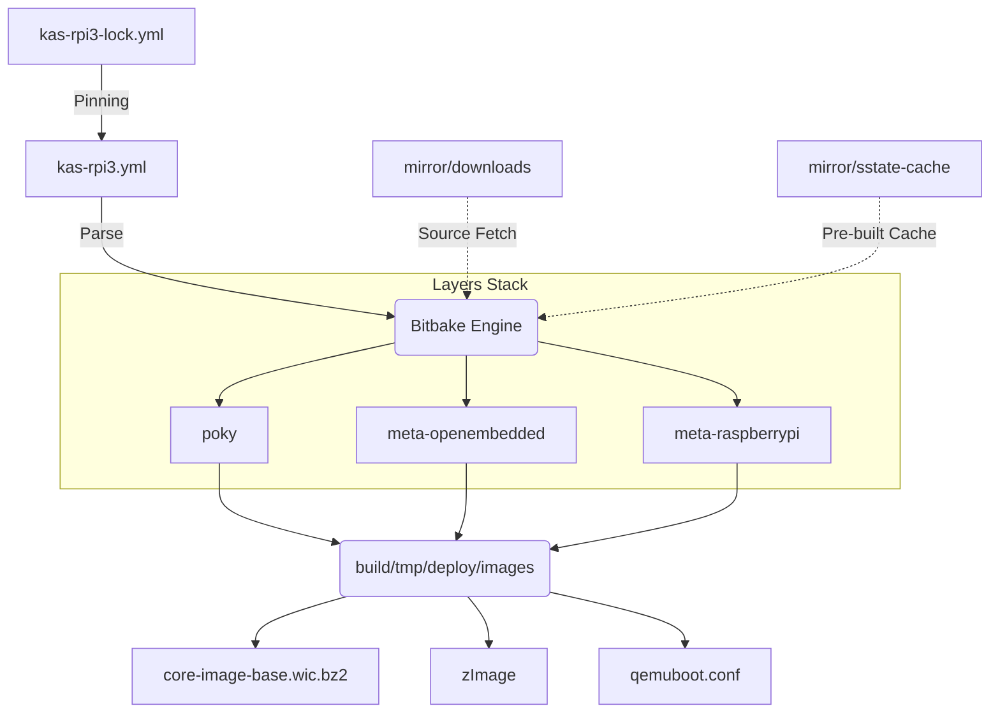

# Yocto Project Architecture: Raspberry Pi 3 (scarthgap)

이 문서는 본 프로젝트의 빌드 시스템 아키텍처, 물리적 디렉터리 구조, 그리고 Yocto 레이어(Layers) 및 주요 패키징 대상에 대한 전체적인 개념도(Architecture)를 서술합니다.

## 1. 아키텍처 개요 (System Architecture Overview)

본 프로젝트는 순수 Bitbake 대신 컨테이너 친화적이고 재현성이 높은 **`kas`**(Configuration as Code) 유틸리티 단위로 설계되었습니다.



---

## 2. 전체 디렉터리 물리 구조 (Directory Structure)

빌드가 구동되는 `rpi3/` 디렉터리의 핵심 파일 트리는 다음과 같습니다.
(*Yocto는 특성상 수십만 개의 파일이 생성되므로 워크플로우를 주도하는 코어 디렉터리만 정리합니다.*)

```text
rpi3/
├── kas-rpi3.yml          # Yocto 전체 환경 설정의 진입점 (Repositories, Local configs)
├── kas-rpi3-lock.yml     # scarthgap 브랜치 상의 Git Commit Hash 상태를 영구 저장(Lock)한 파일
├── README.md                # 초기 빌드 및 SD 플래싱 등의 매뉴얼 가이드
├── ARCHITECTURE.md          # 현재 보고 계신 전체 구조도 문서
│
├── mirror/                  # [중요] 타 PC 재사용 및 빌드 시간 단축을 위한 통합 미러 캐시 버퍼
│   ├── downloads/           # 인터넷에서 다운받은 모든 원본 소스코드 (Tarballs, Git clones)
│   └── sstate-cache/        # 이전 빌드에서 컴파일이 완료된 .o 바이너리 캐시 메타데이터 오브젝트
│
└── build/                   # kas & Bitbake가 실질적으로 동작하며 결과물을 만들어내는 동적 워크스페이스
    ├── conf/                # kas가 자동 생성한 bblayers.conf 및 local.conf
    └── tmp/
        ├── work/            # 개별 패키지들이 압축이 풀리고 patch 및 컴파일이 이루어지는 공간
        ├── sysroots/        # 크로스 컴파일용 (ARM64용 gcc, glibc 등) 가상 루트 파일 시스템
        └── deploy/          
            ├── ipk/         # 설치용 IPK 패키지 결과물
            └── images/      # 최종 OS 바이너리 이미지 (*.wic.bz2, 커널 포함) 및 QEMU 메타데이터
```

---

## 3. 핵심 레이어 스택 (Layer Stack)

레이어는 위에서 아래로 쌓이는(Stacking) 방식이며, 상위 레이어의 레시피(Recipe)나 어펜드 파일(`.bbappend`)이 하위 레이어의 동일한 레시피 설정을 덮어씁니다(Override). 

본 프로젝트(`scarthgap` branch)의 레이어 구조는 다음과 같습니다:

1. **`meta`, `meta-poky`, `meta-yocto-bsp`**
   - 레퍼런스 배포판이자 가장 기본적인 빌드 시스템 코어
   - 컴파일 툴체인(gcc), glibc, 핵심 부팅 파일(systemd, sysvinit) 정의
2. **`meta-openembedded` (`meta-oe, meta-python, meta-multimedia, meta-networking`)**
   - Python 3 런타임, 네트워킹 유틸리티(ssh 등), 멀티미디어 확장이 담긴 방대한 오픈소스 패키지 풀(Pool).
3. **`meta-raspberrypi` (Board Support Package - BSP)**
   - 라즈베리 파이 하드웨어를 위한 독자적인 커널 트리를 다운받고 부트 로더 파티션을 어떻게 자를지(Wic format), GPIO 및 펌웨어(DTB)를 제어하는 레시피 구성

---

## 4. 메인 레시피(Recipes) 및 패키징 대상 (Packages)

현재 타겟 보드에 구워지는 최종 이미지를 위해 Yocto가 설치하는 주요 레시피와 그 역할입니다.

### 4.1. 이미지 타겟
- **`core-image-base` (Target Recipe)**
  - X11/Wayland 기반의 무거운 데스크톱 GUI 요소(Desktop Environment)를 완전히 제거한 순수 터미널 **Headless 전용 콘솔 기반 기본 이미지**입니다.
  - 리소스 낭비가 가장 적고 하드웨어 제어 및 AI 런타임을 올리기에 최적화되어 있습니다.

### 4.2. 하드웨어 드라이버 및 펌웨어 (Firmware)
- **`linux-raspberrypi`**
  - 바닐라 리눅스 커널 소스 대신 RPI 재단이 수정/배포하는 라즈베리 하드웨어 최적화 커널입니다.
- **`linux-firmware-rpidistro-bcm43455`**
  - Raspberry Pi 3 B+ 이상 플랫폼에서 동작하는 무선/블루투스 (WIFI/BT) 칩셋 동작 펌웨어입니다.
  - (Broadcom Synaptics 벤더의 상용 라이선스 보호가 걸려있어 `kas-rpi3.yml` 단에서 `synaptics-killswitch` 라이선스 검증 동의가 통과된 상태입니다.)

### 4.3. 부트 파티션 및 파일시스템 (Boot & RootFS)
- **`sdcard_image-rpi.bbclass` / `wic`**
  - 타겟을 `raspberrypi3`로 지정하면 빌드 엔진은 `wic` 파티셔닝 플러그인을 사용하여 자동으로 1번 파티션은 MS-DOS(FAT) 영역(부트 로더 및 `config.txt` 위치), 2번 파티션은 ext4 포맷의 리눅스 루트 파일시스템(`/`) 구조를 가지는 복합 `.wic` 디스크 이미지를 짜맞춥니다.

### 4.4. 가상화 클래스 활성화
- **`qemuboot` (Class)**
  - 실제 보드(Hardware) 없이 QEMU 에뮬레이터에서 곧바로 RPI3 프로세서와 메모리 구조를 에뮬레이션하여 임베디드 리눅스의 GUI/Console 부팅 상태를 테스트할 수 있게끔 해주는 메타데이터를 함께 패키징하고 있습니다. `kas-rpi3.yml`에 `IMAGE_CLASSES += "qemuboot"` 형태로 주입되어 있습니다.
